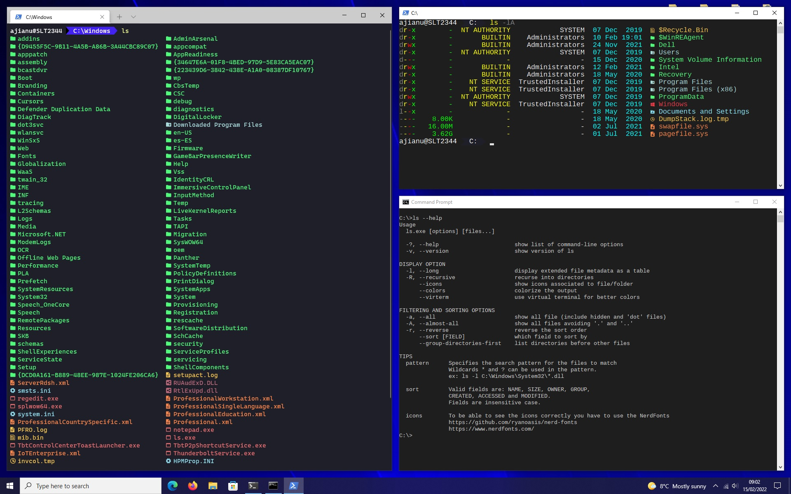

# ls.exe

_**ls**_ is a replacement for the _**dir**_ command, it is inspired by the Unix [ls command](https://en.wikipedia.org/wiki/Ls) to list the content of directory.



## Table of Contents
- [Features](#features)
- [Usage](#usage)
- [Project distribution](#project-distribution)
- [Roadmap](#roadmap)
- [Donations](#donations)
- [License](#license)

## Features
* Show file type `d` for directory, `l` for symbolic link, `-` any other type
* Show user file permissions `r` for read, `w` for write, `x` execution and `-` no permission
* File size displayed in Bytes, MegaBytes, etc. `-` if size can not be retrieved
* To which group the file belongs or `-` if it can not be retrieved
* The owner of the file or `-` if it can not be retrieved
* Creation / Access / Modification date, by default creation in case of sort uses the sort date
* Icons, currently hard-coded, uses [Nerd Fonts](https://github.com/ryanoasis/nerd-fonts), your console has to be able to display [UTF-8](https://en.wikipedia.org/wiki/UTF-8)

## Usage
```
Usage
  ls.exe [options] [files...]

  -?, --help                       show list of command-line options
  -v, --version                    show version of ls

DISPLAY OPTION
  -l, --long                       display extended file metadata as a table
  -R, --recursive                  recurse into directories
      --icons                      show icons associated to file/folder
      --colors                     colorize the output
      --virterm                    use virtual terminal for better colors

FILTERING AND SORTING OPTIONS
  -a, --all                        show all file (include hidden and 'dot' files)
  -A, --almost-all                 show all files avoiding '.' and '..'
  -r, --reverse                    reverse the sort order
      --sort [FIELD]               which field to sort by
      --group-directories-first    list directories before other files

TIPS
  pattern      Specifies the search pattern for the files to match
               Wildcards * and ? can be used in the pattern.
               ex: ls -l C:\Windows\System32\*.dll

  sort         Valid fields are: NAME, SIZE, OWNER, GROUP,
               CREATED, ACCESSED and MODIFIED.
               Fields are insensitive case.

  icons        To be able to see the icons correctly you have to use the NerdFonts
               https://github.com/ryanoasis/nerd-fonts
               https://www.nerdfonts.com/
```

If you are using Command Prompt take into consideration to make an [alias using doskey](https://docs.microsoft.com/en-us/windows-server/administration/windows-commands/doskey) with the parameters you mostly find useful in your day to day. For Powershell make a function in your profile script and bind it to an [alias using Set-Alias](https://docs.microsoft.com/en-us/powershell/module/microsoft.powershell.utility/set-alias?view=powershell-7.2) name.

```bat
# Command prompt
doskey ls=ls.exe --icons --colors --virterm --group-directories-first $*
```

```powershell
# Powershell
function List-Dir()
{
    ls.exe --icons --colors --virterm --group-directories-first @args
}

Set-Alias -name 'ls' -value List-Dir -Option AllScope
```

There is an extra hidden option, `--smd` (show metadata), which shows a list of available extensions with their color and the icon of each.

```shell
# Output format
(r, g, b)  icon  extension
```

## Project distribution
```
| -> utils
    | -> cl.bat             Searching and loading visual studio environment [vcvars.bat]
    | -> build.bat          Build script (calls cl.bat and build the project) [use -h for help]
| -> source
    | -> ls.c               Main entry point, arguments parsing
    | -> types.h            Data structure and enumerators
    | -> sort.[c|h]         Sort functions, sort by size, date, etc
    | -> utils.[c|h]        Small help functions, just to make the life easier
    | -> win32.[c|h]        Windows functions for retrieving the owner, permissions, etc
    | -> screen.[c|h]       Print to screen the listed files and directories
    | -> directory.[c|h]    Windows functions to get the content of the directory
| -> resources
    | -> screenshot.jpg     Screenshot used on this README
```

To build the project make sure you have installed one of the versions of [Visual Studio](https://visualstudio.microsoft.com) listed on [cl.bat](utils/cl.bat). Once you have it installed just run [the build script](utils/build.bat), it will generate a build directory on the root of the project.

```
build.bat [--build-type=Release|Debug] [--platform=x64|x86] [--build-path=<output directory>] [--install=<directory>]
By default: --build-type=Release --platform=x64 --build-path=<project root>
   --build-type    type of build, 'Release' or 'Debug'
   --build-path    directory where binaries are generated
   --platform      'x64' for 64 bits or 'x86' for 32 bits
   --install       copy the program to the given directory
   --clean         remove the previous build data
   --help, -h      show help
```

## Roadmap
* Consider configuration file for colors and icons

## Donations
This is free, open-source software. If you'd like to support the development of future projects, or say thanks for this one, you can donate:
| Crypto | Address | Network |
|----------|:-------------:|------:|
| BTC | 1HanuT8wZo85kMDShkMy6TsJo1VJ6mzsWs | BTC |
| ETH | 0x8e249fb24e71459184c836f9fc53d32f09d44555 | ERC20 |
| USDT | TXkofuYzGiLTS6GP2K2RMKJ4y6xqBZV8Pf | TRC20 |

## License
ls.exe is distributed under the terms of the Apache License Version 2.0. A complete version of the license is available in the [LICENSE.md](LICENSE.md) in this repository. Any contribution made to this project will be licensed under the Apache License Version 2.0.
